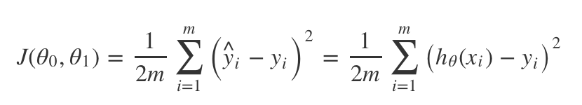
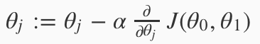
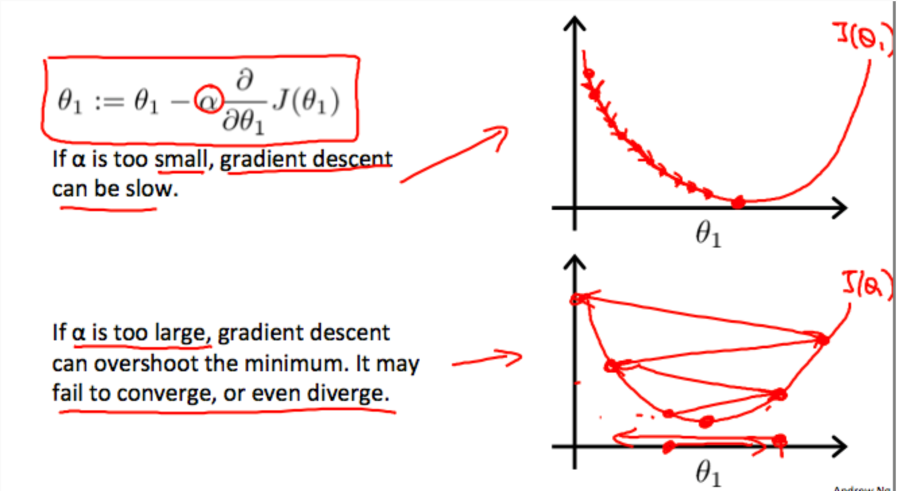
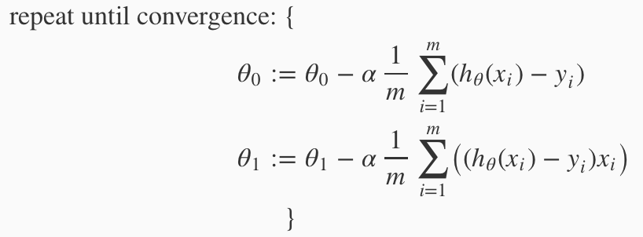
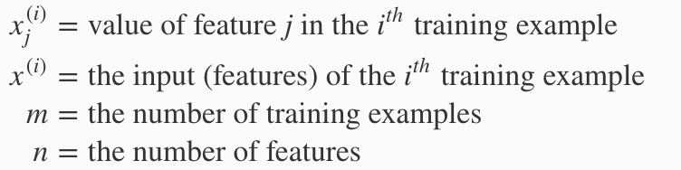
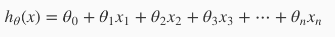
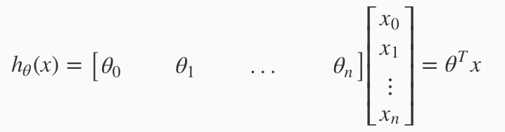

# Machine Learning

> 基于coursera上Andrew Ng的课程

## Introduction

* Machine Learning

  A computer program is said to learn from experience E with respect to some task T and some performance measure P, if its performance on T,as measured by P, improves with experience E.

* Supervised Learning 

  Right answers is given,learn from the right answer and predict.Can categorized into `regression` and `classification` problem.

* Regression

  Predict continuous valued output

* Classification

  Discrete valued output(0,1,2…),the output also can have more than two values.Using `Support Vector Machine` if you deal with an infinite number of features

* Unsupervised Learning

  Data doesn't have any labels,or we have no idea what our results should look like.Item find the structure by machine itself.Right answers is not given.Has two examples `Clustering Problem` and `Non-clustering Problem`.

###Linear Regression with One Variable

> Linear regression with one variable

* Notation

  `x`：input variable/features

  `y`：output variable/target variable

  `m`：Number of training examples

* Training set

  (x,y) is a traning set.

  (x(i),y(i)) is a training example in training set.

* Hypothesis

  Using training set to learn a function 

  `h:X->Y`,make h(x) a good predictor for the corresponding value of y.

* Parameters

  For Linear Regression,h can be represented as `h(x)=theta(0)+theta(1)x`，theta is the parameters.Our purpose is to choose theta so that h(x) is close to y for training examples(x,y).Or minimize the cost function.

* Cost Function

  

  Also call Squred Error Function,it can measure the accuracy of our hypothesis function.Squared error cost function is a reasonable choice and works well for problems for most regression programs. 

  The cost function for linear regression is always going to be a bow shaped function,or we can call it **convex function**.That has only a global optima without any local optima.

* Gradient Descent

  

  A measure that can estimate the parameters in the hypothesis function, so by using this we don't need to adjust the parameters by ourselves.

  α called **learning rate**,determined the size of each step.

  

  As approach a local minimum,gradient descent will automatically take smaller steps, so no need to decrease α over time.

  

  Don't forget our purpose is to minimum J.

  Remember to **simultaneously update** the parameters θ1,θ2,…,θn at each iteration j.

  Repeat the algorithm until convergence.

  

* Batch gradient descent

  We will look all the training examples in the training set in each step of  gradient descent.

## Multivariate Linear Rgression

> Linear Regression with multiple variables 

* Notation

  

* hypothesis

  

  

  ​